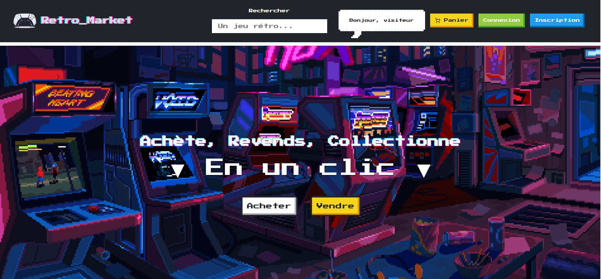
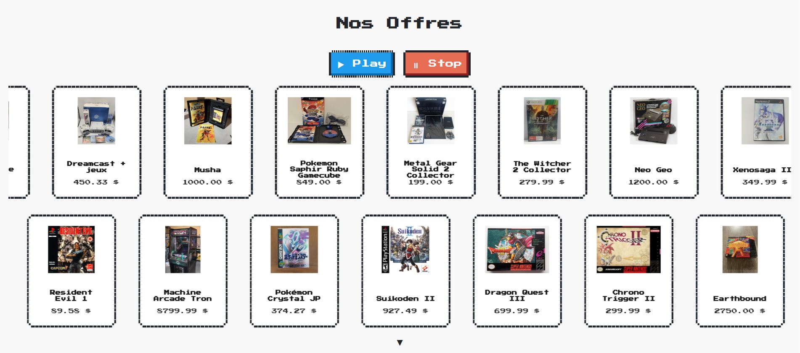
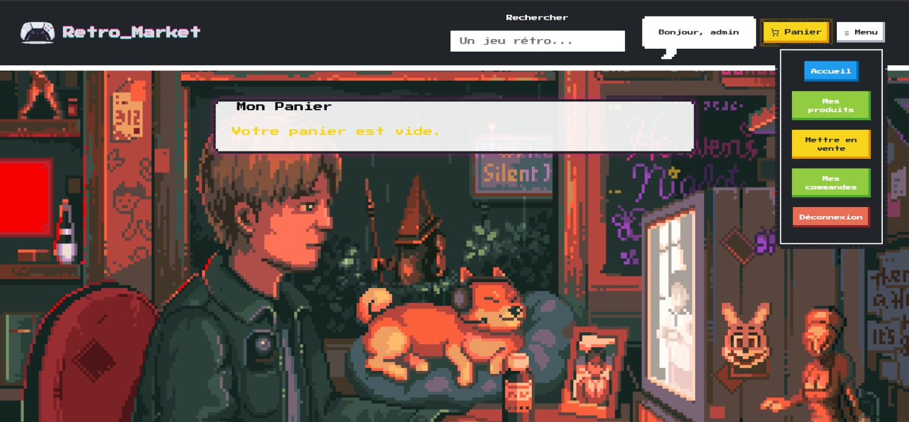
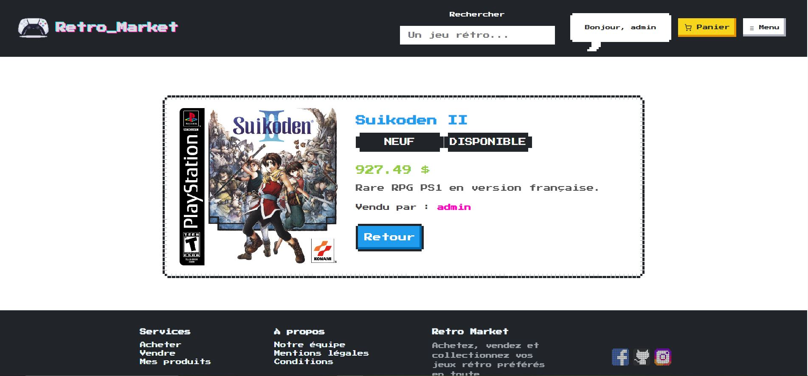

# 🎮 Retro Market

**Retro Market** is a retro video game marketplace inspired by the aesthetic of NES consoles and cyber-neon visuals.  
The project combines a **robust TypeScript backend with a PostgreSQL database**, and a **dynamic frontend** built with **React, TailwindCSS, and Framer Motion**.

> ⚠️ *Please note: The application is in French to reflect its localized context.*

---

## 🖼️ Visual Preview



---

## Features

### 👾 User Side
- Browse retro products through a custom interface
- Dynamic cart with quantity management
- Order form (name, address, fake payment method, etc.)
- Orbital animation around the slogan (inspired by *The Graph* website)
- Fully responsive and animated thanks to **TailwindCSS + Framer Motion**



---

## ⚙️ Backend (Node.js + Express + PostgreSQL)
- Secure authentication (**JWT + bcrypt**)
- User account creation and management
- Product management (CRUD)
- Orders, carts, and purchase history
- Password reset via Gmail (**Nodemailer**)
- Relational PostgreSQL database



---

## 🛠️ Admin (Coming Soon)
- Dashboard to add, edit, and delete products
- View and manage orders



---

## 🧱 Tech Stack

| Layer      | Technology              | Details                              |
|------------|--------------------------|--------------------------------------|
| Frontend   | React                    | SPA with reactive components         |
| UI         | TailwindCSS + NES.css    | Retro pixel art styling              |
| Animations | Framer Motion            | Smooth transitions and effects       |
| Auth       | JWT + bcrypt             | Secure login system                  |
| Backend    | Node.js + Express        | RESTful API                          |
| ORM        | Prisma                   | DB mapping with PostgreSQL           |
| Database   | PostgreSQL               | Optimized relational storage         |
| Emails     | Nodemailer + Gmail       | Password reset system                |

---

## 📅 Upcoming Features

- Wishlist (favorites) system  
- Real-time notifications  
- Product rating and review system  

---

## 📄 License

This project is licensed under the **MIT License**.  
You are free to use, modify, and share it as long as you credit the original author.

---

## 🚀 Run Locally

### 🧰 Prerequisites
- Node.js  
- PostgreSQL  
- Yarn or npm  

### ⚙️ Backend Installation
```bash
cd backend
npm install
npx prisma generate
npx prisma migrate dev --name init
npm run dev

